AI workflows are often presented as something fundamentally new and disruptive.

I am not convinced this is the right way to look at them, especially when considering the distributed systems and workflow engines we have been building for years.

When looking at the architecture rather than the current terminology (not to say "buzz words"), many of the underlying principles remain familiar:

- asynchronous processing,
- durable state,
- message passing,
- retries/timeouts/failure recovery,
- observability,
- and workflow orchestration.

What changes with AI is less the distributed architecture itself than the nature of some of the computations, and sometimes the LLM in the orchestration loop itself.

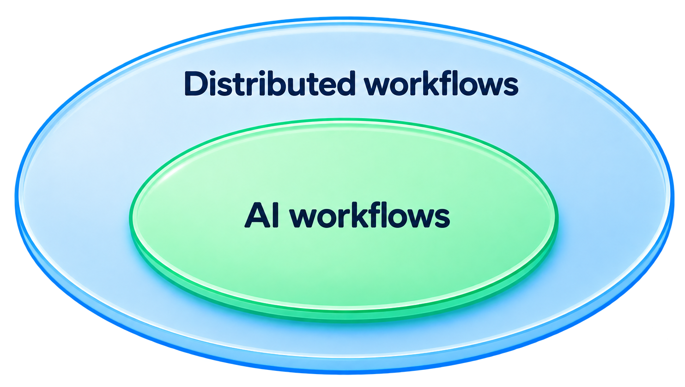

## Starting from a traditional distributed workflow

Consider a fairly standard data or backend workflow:

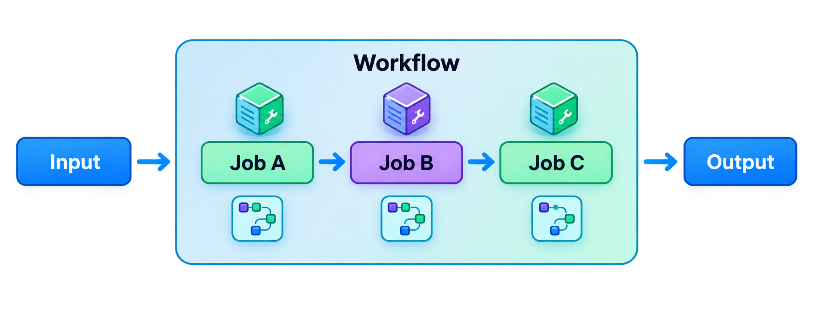

The individual jobs can be distributed and quite sophisticated.

For example:

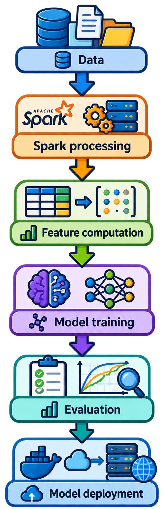

The workflow orchestration itself is usually explicit.

The system knows that *B* depends on *A*, *C* depends on *B*, and so on.

An orchestration system such as a scheduler or workflow engine mainly answers questions such as:

- Which job can run?
- What are its dependencies?
- Has the previous step completed?
- Should it be retried?
- What happens if a worker fails?
- Where should the result be stored?

This is already a distributed-systems problem.

The computation can be deterministic or not, but the workflow structure is generally known in advance.

## Adding an LLM as a computation

Now we can consider:

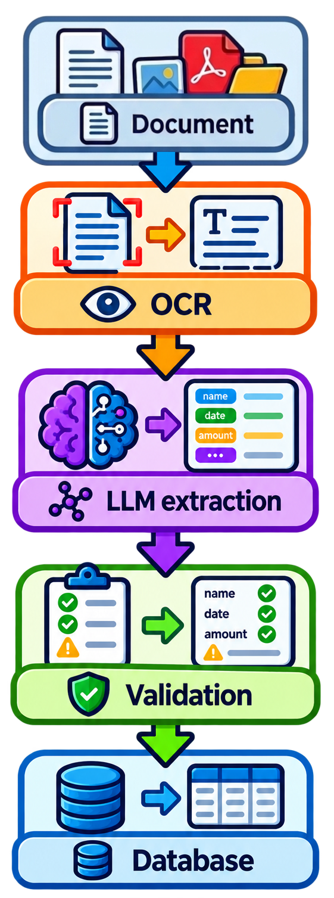

There is an LLM in the workflow, but the workflow itself has not fundamentally changed.

It is still `A → B → C → D`.

The LLM is simply one of the computations.
This is an important distinction I think: **using an LLM inside a workflow does not by itself make the workflow agentic or dynamically orchestrated**.

An LLM can be treated much like another distributed job or service:

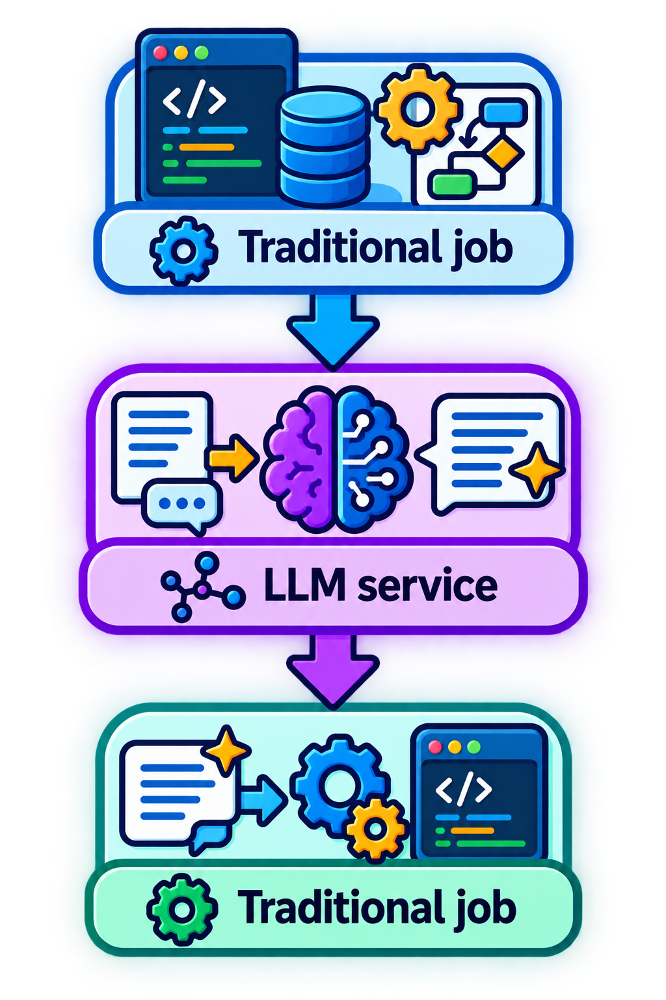

The rest of the architecture can remain largely conventional.

## Where it becomes different: the control flow

The more interesting case is when the LLM is not only performing a computation, but is also involved in deciding what should happen next.

For example:

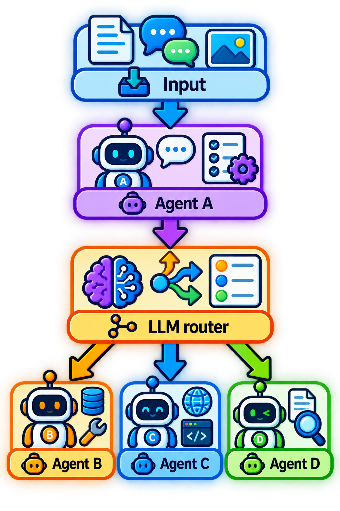

The orchestrator does not necessarily contain all the routing rules anymore.

The result of the previous step can be interpreted by an LLM, which selects dynamically the next operation.

This can be useful when the routing decision depends on semantic information rather than a small set of well-defined fields.

A traditional router might look like:

```python
if type == "billing":
   billing_agent()
elif type == "contract":
   contract_agent()
elif type == "technical":
   technical_agent()
```

This works well when the classification rules are known and stable.

But consider an output such as:

> The customer appears to have a billing dispute related to an invoice, although the response also refers to a possible contractual disagreement.

The next action may not be easily expressed as a few deterministic rules.

An LLM can interpret the result and decide which specialist should be involved.

The workflow then becomes:

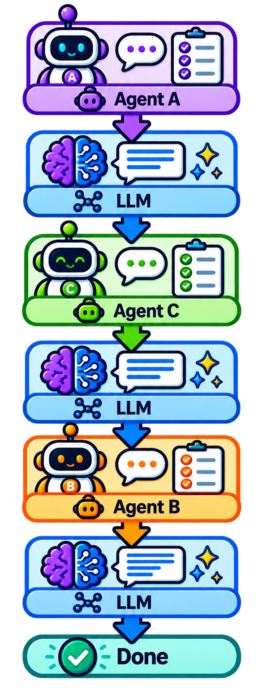

The important change is therefore not simply that an LLM exists somewhere in the system.

It is that the **LLM can become part of the control plane**.

## Three different cases

I find it useful to distinguish at least three levels.

**1. LLM as a job**

```
A → LLM → B → C
```

The workflow is deterministic.

The LLM performs one of the steps.

**2. LLM-assisted routing**

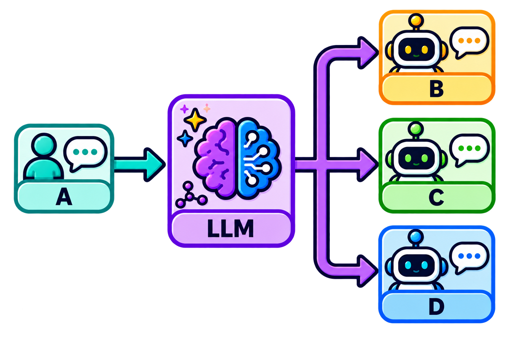

The LLM helps determine the next step.

The workflow is now partially dynamic.

**3. LLM-driven planning**

The model can determine not only the next step, but potentially a sequence of steps.

For example:

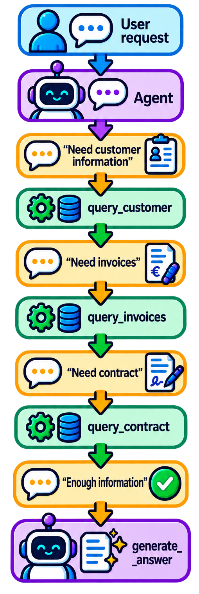

Here the complete path may not have been known when the workflow started.

This is much closer to what I would personally call an agentic workflow.

## The architecture is still a distributed system

Even in this last case, most of the underlying engineering problems are familiar.

An agent may need to:

- call remote services,
- wait for responses,
- retry failed operations,
- respect timeouts,
- limit concurrency,
- persist state,
- survive process failures,
- resume after a crash,
- avoid duplicated side effects,
- emit traces and metrics.

Nothing about using an LLM removes these requirements.

In fact, they may become more important because an agent can execute a longer and less predictable sequence of operations.

A useful architecture can therefore still look like:

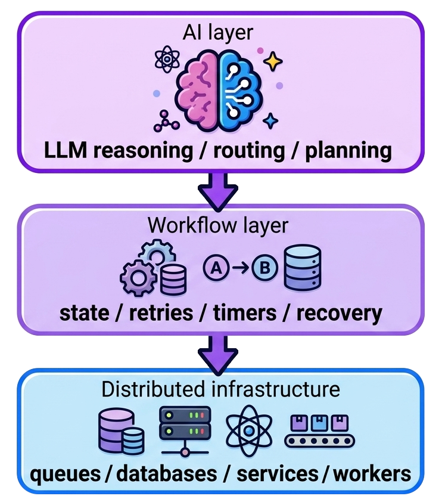

The bottom part does not become obsolete because the top part contains an LLM.

## AI-specific technologies are not necessarily new architectural primitives

There are technologies that are now much more prominent in AI-related architectures.

For example:

- vector databases,
- embeddings,
- semantic search,
- RAG,
- document retrieval,
- context stores.

But I would be careful about considering these as entirely new architectural concepts.

A vector database is still, at its core, a database/index optimized for a particular kind of search. Semantic search existed before the current LLM wave, and vector indexes have been used for recommendation, similarity search, image search and other applications.

Likewise, the basic idea behind RAG is not particularly new:

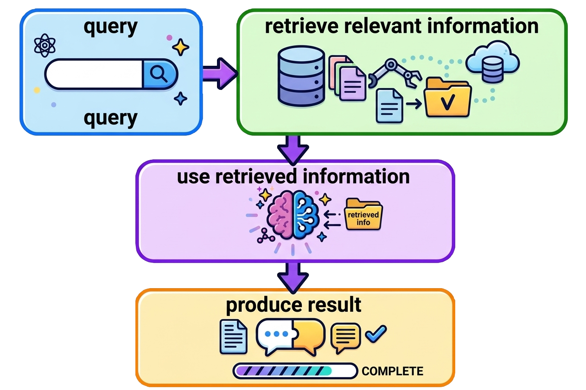

Information retrieval systems have been doing something structurally similar for a long time. Search indexes, document stores and ranking systems have traditionally selected a relevant subset of a larger corpus before passing it to the next processing step.

What changes with LLMs is mainly what we do with the retrieved information.

Instead of: `query → search → ranked documents`

we can have:

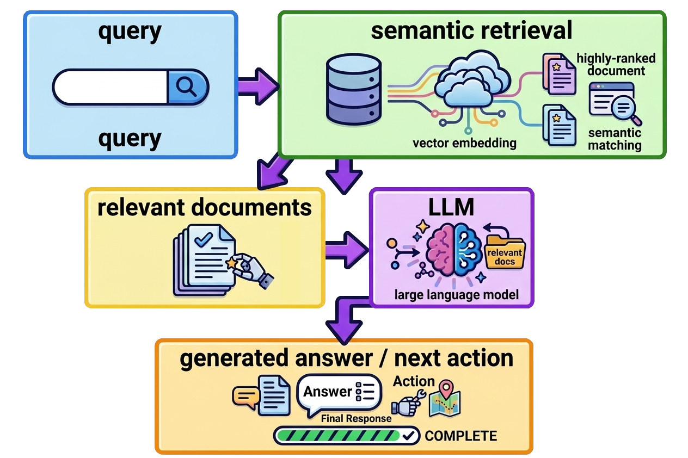

The combination is new and powerful, but many of the individual building blocks are not.

This is another reason why I find it more useful to look at the underlying architecture rather than at the terminology used around it.

## Conversation state is still state

Another aspect that is sometimes presented as particularly specific to AI is conversation context.

Technically, I see it mostly as another form of application state.

A conversation can be represented as messages:

```
conversation_id → message message message tool call tool result message ...
```

This can be persisted in a database, just like other application data, or using a specific store.

The important distinction is between the **system's state** and the **LLM's context window**.

The model does not necessarily receive the complete history.

This is not particularly different from traditional ML systems. A model may have access to a large historical dataset in a database or data lake, while an individual inference only receives the subset of data relevant to that prediction — its features or input.

Likewise, the application can have a complete conversation and workflow history, while constructing only a relevant context for a particular LLM call.

A request to an LLM may therefore be constructed from:

```
system instructions
 + recent messages
 + selected historical messages
 + workflow state
 + retrieved information
 + tool results
```

The context sent to the model is therefore a projection of the application's durable state.

The difference with traditional ML is mainly that the "features" can be much less structured: conversation messages, documents, previous tool results, or other retrieved information.

## Different kinds of state

It is also useful not to conflate several things that are sometimes all called "memory" or "history".

There can be:

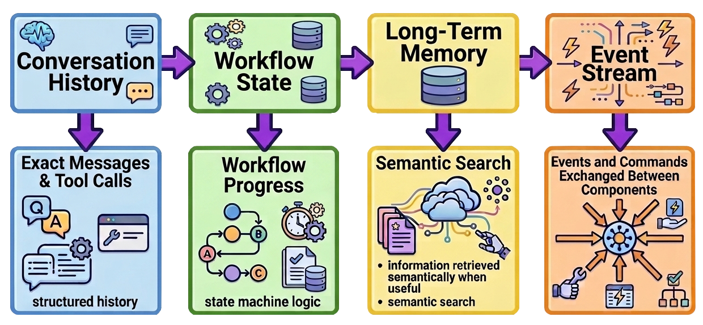

These can use different technologies.

A traditional database (e.g. PostgreSQL) might contain the durable conversation and workflow state.

Kafka (or Pulsar or whatever message bus) might transport events.

Redis might contain short-lived state.

A vector store might provide semantic retrieval.

Most of the time, there is no fundamental reason for all of this to be stored in a specialized "AI database".

## Agent frameworks versus workflow infrastructure

This also makes the distinction between agent frameworks and distributed workflow systems clearer.

[LangGraph](https://docs.langchain.com/oss/python/langgraph/overview) is a low-level orchestration framework and runtime for long-running, stateful agents. It is therefore relatively close to the agent layer, with concepts such as state, graph transitions, persistence and durable execution.

The [OpenAI Agents SDK](https://openai.github.io/openai-agents-python/) is another example. It provides agents, tools, handoffs, guardrails, sessions and tracing, with the runtime managing the agent loop and tool execution.

Other systems are more fundamentally concerned with durable execution.

[Restate](https://restate.dev/) is an example of this category.

Its interesting property is not specifically that it runs AI agents, but that it can make a long-running workflow durable:

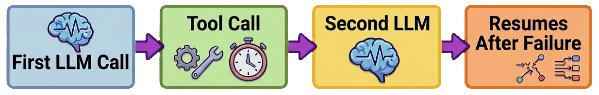

This is a distributed execution problem that existed before LLMs.

[Akka](https://doc.akka.io/) is another useful comparison.

Akka started from the actor model and distributed systems. Today its platform also explicitly covers agentic AI, orchestration and memory, while retaining the distributed-systems foundations underneath.

An agent can naturally be represented using the same concepts:

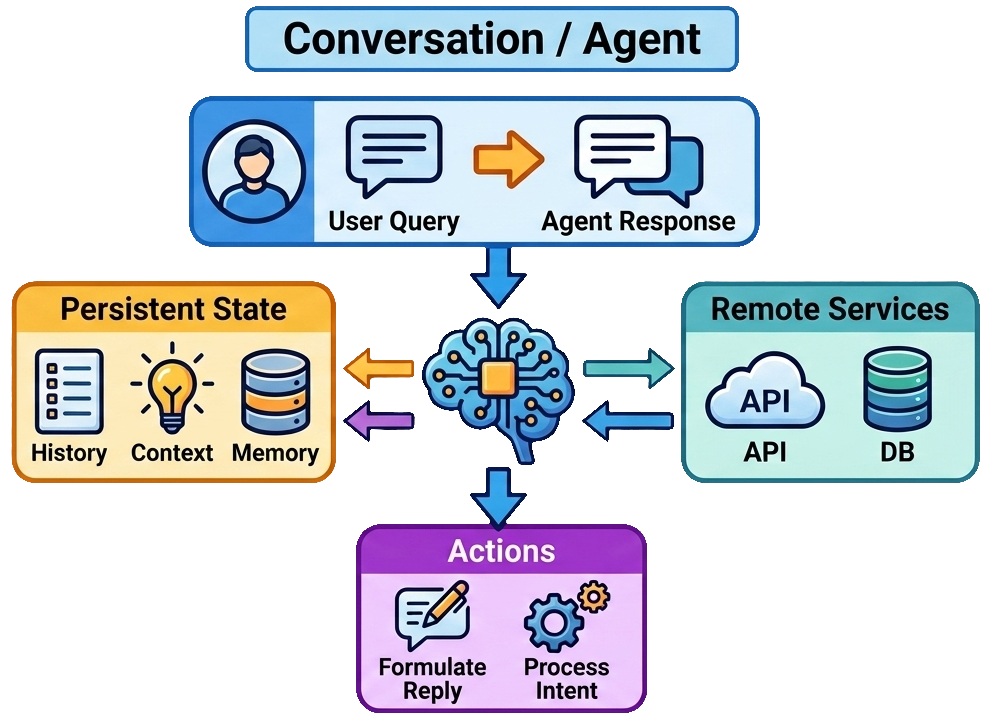

The fact that an LLM is involved does not make actor semantics, supervision, persistence, messaging, or failure handling irrelevant.

## Where I see the real architectural difference

For me the interesting distinction is therefore not:

**Traditional distributed systems vs AI systems**

but rather:

**Deterministic workflow vs Partially dynamic workflow**

A traditional workflow might be `A → B → C → D`.

An AI-assisted workflow can be: `A -LLM→ B → C -LLM→ D`.

The LLM introduces probabilistic decision-making into the control flow.

This changes several engineering properties.

A traditional workflow can often be tested with explicit examples: `input X → path A → B → C`

For an LLM-driven router, the question becomes more like:

<q>Given this input and state, does the model choose the appropriate next action?</q>

The system therefore needs additional concerns:

- evaluation of routing decisions,
- guardrails,
- constrained tool selection,
- validation of model outputs,
- handling non-determinism,
- token and latency costs,
- tracing of model decisions.

But underneath these concerns, the usual distributed-systems concerns remain.

## When should an LLM control the workflow?

I would not use an LLM simply because it is available.

If a routing rule is well-defined: `payment_failed → payment_recovery`

a normal conditional is probably better.

It is cheaper, deterministic, easier to test, and easier to reason about.

An LLM becomes more interesting when the decision requires interpretation.

For example:

<q>What is the customer actually asking for?</q>

or:

<q>Given what we have discovered so far, what information should we retrieve next?</q>

or:

<q>Which specialist should handle this case?</q>

These decisions can benefit from the ability of an LLM to interpret unstructured inputs and previous outputs.

This gives a simple principle:

> Use traditional orchestration when the control rules are known and explicit. Use LLM-based orchestration when the control decision itself benefits from semantic interpretation.

## A continuum rather than a boundary

I therefore don't see a sharp boundary between traditional workflows and AI workflows.

There is more of a continuum:

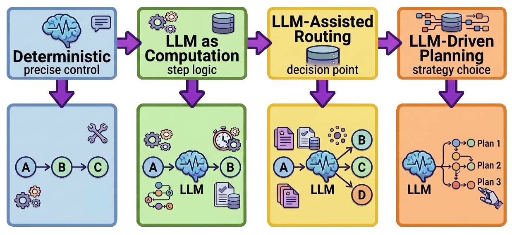

In the end a real system can contain all of these at the same time.

For example, an LLM agent might decide that it needs customer data, invoke a traditional backend service, which publishes an event to Kafka, triggering a distributed processing job, whose structured result is then given back to the agent.

The architecture is not "AI instead of distributed systems".

It is a **distributed system in which some computations, and potentially some control decisions, are performed by using AI models**.

That seems to me a more pragmatic starting point than treating agentic systems as an entirely new architectural paradigm.
