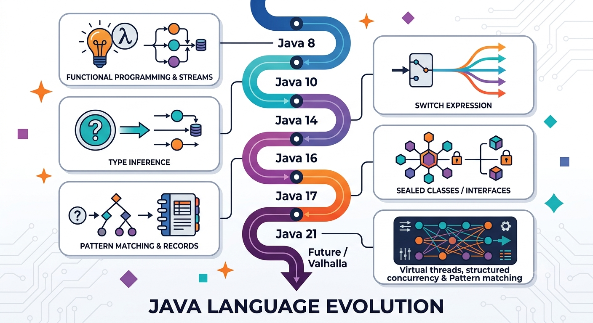

Like many developers of my generation, I started programming with Java, and it was also the first language I used professionally (with Java EE projects).

Since then, I have worked on and delivered systems using various stacks (but that's not the point here 🙂), while still often having at least some part running on the JVM, sometimes with non-vanilla languages and/or ecosystems (for example Scala with Spark for data engineering).

Java has also continued to evolve during that time. Some changes were incremental improvements, while others introduced concepts that had already become familiar in other JVM or non-JVM languages.

I find it useful to look back at this evolution, especially from a developer perspective: what changed in the language itself, what ideas influenced these changes, and how Java adapted while keeping its main constraint: strong backward compatibility and solid ecosystem.

This is an opinionated review, mostly focused on language evolution rather than libraries or tooling.

Before diving in, one clarification: this is not intended to be an exhaustive changelog of every Java release (in this AI era you will find plenty around).

I deliberately focus on the language features and concepts that, in my opinion, have had the most noticeable impact on day-to-day development. Some important platform, library or JVM improvements are therefore only briefly mentioned—or not covered at all.



## Java 8: major turning point

🌟 **Java 8 was probably one of the biggest evolutions since the beginning of Java.**

One of the main goal was to introduce more functional programming concepts while keeping the existing object-oriented model.

### Lambda expressions

🌟 **Lambda expressions**

Before Java 8, passing behavior usually meant creating anonymous classes:

```java
Runnable task = new Runnable() {
    @Override
    public void run() {
        System.out.println("hello");
    }
};
```

Java 8 introduced lambdas:

```java
Runnable task = () -> System.out.println("hello");
```

This brought a more functional style to Java, already familiar to many developers through languages such as Scala.

Scala already had first-class functions:

```scala
val task = () => println("hello")
```

The same general idea also exists in languages such as TypeScript:

```typescript
const task = () => console.log("hello");
```

The main difference is that Java lambdas are not values with a native function type. They need a target functional interface:

```java
Function<String, Integer> length = s -> s.length();
```

The lambda becomes an implementation of `Function`.

This design is more verbose than Scala's function types, but fits Java's existing type system.

### Functional interfaces

⭐ **Functional interfaces**

A functional interface is an interface with a single abstract method:

```java
@FunctionalInterface
interface Calculator {
    int apply(int a, int b);
}
```

Then:

```java
Calculator add = (a, b) -> a + b;
```

Java also introduced standard ones:

```java
Function<T, R>
Predicate<T>
Consumer<T>
Supplier<T>
```

This is somewhat comparable to Scala traits containing an `apply` method:

```scala
trait Calculator {
  def apply(a: Int, b: Int): Int
}
```

but Scala usually uses function types directly:

```scala
val add: (Int, Int) => Int = (a, b) => a + b
```

Kotlin followed a similar direction with **SAM (Single Abstract Method) interfaces**:

```kotlin
fun interface Calculator {
    fun apply(a: Int, b: Int): Int
}

val add = Calculator { a, b -> a + b }
```

So Java and Kotlin both use interfaces as the bridge between object-oriented design and lambda syntax, while Scala has a more direct function type model.

### Stream API

🌟 **Stream API**

The Stream API changed how many Java developers write collection transformations.

Before:

```java
List<String> result = new ArrayList<>();

for (String name : names) {
    if (name.startsWith("A")) {
        result.add(name.toUpperCase());
    }
}
```

After:

```java
List<String> result =
    names.stream()
         .filter(name -> name.startsWith("A"))
         .map(String::toUpperCase)
         .toList();
```

The concepts are very close to Scala collections:

```scala
val result =
  names
    .filter(_.startsWith("A"))
    .map(_.toUpperCase)
```

The main ideas are the same:

- composable transformations
- lazy evaluation (until terminal operation)
- declarative processing

The difference is that Scala integrates these concepts much deeper into collections, while Java keeps `Collection` and `Stream` as separate abstractions.

### Default methods in interfaces

⭐ **Default methods in interfaces**

Before Java 8, adding a method to an interface was a breaking change, as existing implementations would suddenly miss the new method.

Java 8 introduced default implementations:

```java
interface Logger {
    default void info(String message) {
        System.out.println(message);
    }
}
```

This looks close to Scala traits:

```scala
trait Logger {
  def info(message: String) =
    println(message)
}
```

but the intent was different.

Java default methods were mainly introduced to allow evolving existing APIs (`Collection`, for example), not to create a complete trait system.

Java interfaces still cannot have:

- instance state

Also, introducing implementation in interfaces raised the well-known **diamond problem** from multiple inheritance.

For example:

```java
interface A {
    default void hello() {
        System.out.println("A");
    }
}

interface B {
    default void hello() {
        System.out.println("B");
    }
}

class C implements A, B {
}
```

This is rejected by the compiler because Java cannot guess which implementation should win.

The conflict must be explicitly resolved:

```java
class C implements A, B {

    @Override
    public void hello() {
        A.super.hello();
    }
}
```

Java chose explicit resolution rather than Scala-style trait linearization rules, keeping interface inheritance more predictable.

### Method references

🔹 **Method references**

Java added a shorter way to refer to existing methods:

```java
names.forEach(System.out::println);
```

instead of:

```java
names.forEach(name -> System.out.println(name));
```

This is close to Scala's ETA-expansion: converting an existing method into a function value.

## Java 9: smaller but important changes

### Private methods in interfaces

🔹 **Private interface methods**

Once interfaces could contain default methods, duplication became possible:

```java
interface Logger {

    default void info(String msg) {
        // formatting logic
    }

    default void warn(String msg) {
        // same formatting logic
    }
}
```

Java 9 added private interface methods:

```java
interface Logger {

    default void info(String msg) {
        log("INFO", msg);
    }

    private void log(String level, String msg) {
        System.out.println(level + msg);
    }
}
```

This is mainly an extension of default methods.

### Modules

⭐ **Java modules**

Java 9 also introduced the module system:

```java
module my.application {
    requires java.sql;
    exports my.api;
}
```

This is less a language evolution and more about:

- packaging
- dependency boundaries
- runtime encapsulation

It mainly affects the JVM platform itself, but naturally benefits JVM-based languages as well.

## Java 10: local variable inference

🌟 **Local variable inference (`var`)**

Java introduced:

```java
var users = new ArrayList<User>();
```

The compiler infers:

```java
ArrayList<User> users = new ArrayList<User>();
```

Important: Java remains statically typed.

The goal was not to introduce dynamic typing, but to remove unnecessary repetition.

For example, TypeScript also has type inference:

```typescript
const users = new Array<User>();
```

while remaining statically typed.

Java also supports:

```java
final var users = new ArrayList<User>();
```

which is close to Scala's:

```scala
val users = ArrayBuffer[User]()
```

As simple as it looks, this was a significant developer experience improvement.

One of the usual criticisms of Java has always been verbosity, especially compared with languages with stronger type inference.

`var` removed a lot of unnecessary repetition while keeping static typing.

There are still some inference cases where Java is more limited than languages such as Scala or Kotlin.

For example:

```java
var f = x -> x + 1;
```

does not compile because the lambda still needs a target functional interface:

```java
Function<Integer, Integer> f = x -> x + 1;
```

Java inference is therefore intentionally conservative: it helps remove redundant information, but does not try to infer everything.

## Java 14+: moving toward a more expressive language

### Switch expressions

🌟 **Switch expressions**

Traditional Java `switch` was statement-oriented:

```java
String result;

switch(day) {
    case MONDAY:
        result = "work";
        break;
}
```

Modern Java:

```java
String result =
    switch(day) {
        case MONDAY -> "work";
        case SUNDAY -> "rest";
    };
```

This is closer to Scala's `match` expressions:

```scala
val result = day match {
  case Monday => "work"
}
```

This evolution was also an important step toward pattern matching in Java.

### Text blocks

🔹 **Text blocks**

Java added multiline strings:

```java
String json = """
{
  "name": "John"
}
""";
```

This removes a lot of escaping and makes embedded content easier to read.

The idea is similar to multiline string literals available in other languages, including Scala:

```scala
val json =
"""
{
  "name": "John"
}
"""
```

A relatively small feature, but a noticeable improvement when working with SQL, JSON, XML, or other embedded formats.

### Records

🌟 **Records**

Records are probably one of the most visible language improvements.

Before:

```java
final class Point {
    private final int x;
    private final int y;

    // constructor
    // getters
    // equals
    // hashCode
    // toString
}
```

After:

```java
record Point(int x, int y) {}
```

This is very close to Scala case classes:

```scala
case class Point(x: Int, y: Int)
```

Both provide:

- concise data representation
- generated equality
- generated string representation
- immutable components

Java records are intentionally more limited. They are mainly data carriers, not a replacement for normal classes.

They also integrate well with newer language features such as pattern matching:

```java
record Point(int x, int y) {}

if (obj instanceof Point p) {
    System.out.println(p.x());
}
```

## Pattern matching

🌟 **Pattern matching**

Java progressively introduced pattern matching.

Before:

```java
if (obj instanceof String) {
    String s = (String) obj;
    System.out.println(s.length());
}
```

After:

```java
if (obj instanceof String s) {
    System.out.println(s.length());
}
```

Later, pattern matching was extended to `switch`:

```java
switch(obj) {
    case String s -> s.length();
    case Integer i -> i;
}
```

This is a style already familiar from Scala:

```scala
obj match {
  case s: String => s.length
  case i: Int => i
}
```

The goal is not only shorter syntax, but also making type-based branching safer and more expressive.

Java continued this evolution with record patterns:

```java
record Point(int x, int y) {}

switch(obj) {
    case Point(int x, int y) ->
        System.out.println(x + y);
}
```

Pattern matching is probably one of the clearest examples of Java adopting concepts that have been common in functional programming languages for years.

## Sealed classes

🌟 **Sealed classes**

Sealed types restrict inheritance:

```java
sealed interface Shape
    permits Circle, Rectangle {
}

final class Circle implements Shape {}

final class Rectangle implements Shape {}
```

The idea is:

> "These are the possible implementations of this type."

This is close to Scala sealed traits:

```scala
sealed trait Shape

case class Circle() extends Shape
case class Rectangle() extends Shape
```

Sealed types become particularly useful together with pattern matching because the compiler knows the possible cases.

For example, a future Java version could potentially detect missing cases:

```java
switch(shape) {
    case Circle c -> ...
    case Rectangle r -> ...
}
```

## Java 21: concurrency evolution

### Virtual threads

🌟 **Virtual threads**

Virtual threads are one of the biggest runtime evolutions in recent Java versions.

Traditional model:

```
1 Java thread = 1 OS thread
```

Virtual threads:

```
many JVM threads
        |
 JVM scheduler
        |
 fewer OS threads
```

Example:

```java
Thread.startVirtualThread(() -> {
    callRemoteService();
});
```

The idea is related to lightweight concurrency models such as Go goroutines.

It also addresses a problem similar to Node.js' event-loop model: handling a very large number of concurrent I/O operations efficiently.

The execution model is different though:

- Node.js relies on asynchronous callbacks/promises and an event loop.
- Java virtual threads keep the traditional blocking programming model while multiplexing many virtual threads onto a smaller number of OS threads.

This is particularly useful for I/O-bound workloads:

- HTTP calls
- database queries
- network operations

It does not make CPU-heavy tasks faster.

Like every abstraction, there are also limitations. For example, some operations can still pin virtual threads to carrier threads.

### Structured concurrency

⭐ **Structured concurrency**

The goal is to make concurrent tasks have a clear lifetime.

Without structured concurrency:

```java
Future<User> user = executor.submit(loadUser);
Future<Order> order = executor.submit(loadOrder);
```

the relationship between parent work and child tasks is mostly manual.

With structured concurrency:

```java
try (var scope =
     new StructuredTaskScope.ShutdownOnFailure()) {

    var user = scope.fork(() -> loadUser());
    var order = scope.fork(() -> loadOrder());

    scope.join();
}
```

The idea is similar to structured coroutine scopes.

A task started inside a scope should finish inside that scope, making cancellation and error handling easier to reason about.

This follows a broader trend: making concurrency safer by giving it explicit structure instead of managing independent tasks manually.

## What Java still does not have

Despite all these changes, Java remains different from some other modern languages.

There are still no native language features for:

- currying
- first-class function types
- Scala-style trait composition
- higher-kinded types
- typeclass mechanisms (such as Haskell typeclasses or Scala 3 `given`/`using`)
- default arguments
- named arguments

Some of these features are not just syntax improvements. They represent different approaches to abstraction and type systems.

### Typeclass-style mechanisms

Java does not have a built-in typeclass mechanism.

A typeclass allows defining behavior separately from a type and letting the compiler select the appropriate implementation.

For example, in Scala 3:

```scala
trait Show[T] {
  def show(value: T): String
}

def printValue[T](value: T)(using show: Show[T]) =
  println(show.show(value))
```

The compiler can automatically find the `Show[T]` implementation.

Java can implement a similar pattern using interfaces:

```java
interface Show<T> {
    String show(T value);
}
```

and explicit passing:

```java
static <T> void printValue(T value, Show<T> show) {
    System.out.println(show.show(value));
}
```

This works, but the selection remains explicit.

Kotlin also does not provide a built-in typeclass mechanism. It can approximate some patterns using:

- interfaces
- extension functions
- context receivers

but without compiler-supported instance resolution.

This is a deliberate design difference: Java and Kotlin generally prefer explicit dependencies rather than implicit resolution.

### Default arguments and named arguments

Java still does not have default arguments:

```scala
def connect(host: String, port: Int = 8080)
```

or named arguments:

```scala
connect(host = "localhost", port = 8080)
```

The usual Java alternatives remain:

- method overloads
- builders
- configuration objects

For example:

```java
Connection connect(String host) {
    return connect(host, 8080);
}

Connection connect(String host, int port) {
    ...
}
```

## Final thoughts

Looking at Java since version 8, the direction is quite clear:

- Java 8 brought functional programming concepts.
- Java 14–17 made the language more expressive with records, sealed types and pattern matching.
- Java 21 modernized concurrency with virtual threads and continued the move toward structured concurrency.

Many of these ideas were already present in other ecosystems, but Java integrated them progressively while keeping compatibility with existing code.

The interesting part is not that Java became another language. It did not.

It gradually adopted concepts that proved useful elsewhere while adapting them to its own constraints:

- explicitness
- backward compatibility
- long-term stability

For JVM developers, the result is that modern Java feels quite different from older versions while still remaining recognizably Java.

## What's next?

Java's evolution is clearly not over.

A few topics are particularly worth keeping an eye on:

### Project Valhalla

**Project Valhalla** aims to introduce value types (also referred to as primitive classes).

The goal is to improve memory layout and runtime efficiency while keeping an object-oriented programming model.

This could become one of the most significant JVM evolutions since generics.

### Pattern matching evolution

Pattern matching is still evolving.

The direction is to make Java type modeling and data processing more expressive, especially combined with:

- records
- sealed types
- exhaustive `switch`

The goal is not to turn Java into a purely functional language, but to make common domain modeling patterns less verbose.

### Project Loom beyond virtual threads

Virtual threads are only one part of Project Loom.

Other areas, such as structured concurrency, aim to provide better abstractions for concurrent programming.

The broader direction is to make highly concurrent applications easier to write and reason about without forcing every developer into callback-based or reactive programming models.

### Continued improvements to type inference

Java has already made progress with `var` and target typing, but there are still cases where languages such as Scala or Kotlin can infer more.

Further improvements would need to balance:

- reducing unnecessary verbosity
- keeping error messages understandable
- preserving Java's readability

Looking back at Java's evolution since version 8, one thing stands out: the language has remained consistent in its philosophy.

Rather than adopting every possible feature, Java has gradually integrated ideas from the broader programming ecosystem and adapted them to its own constraints and priorities.

As someone who still spends a significant part of the time on the JVM, even when using other languages, I find it interesting to step back and look at this evolution as a whole.

Beyond individual features, it also reflects how ideas circulate across programming languages, mature over time, and eventually become part of what many developers consider normal development.
