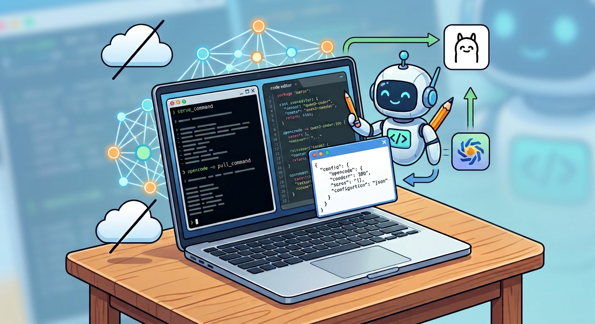

Anyone can now experiment with local large language models without relying on cloud services or third-party providers. Using [Ollama](https://ollama.com) for model serving and [OpenCode](https://opencode.ai/) as an open-source AI coding agent, you can run generative AI directly on your machine.



## Setup Steps

1. **Download and install Ollama** from [ollama.com/download](https://ollama.com/download/). This provides local model hosting capabilities.

2. **Start the Ollama server** by running `ollama serve` in a terminal.

3. **Pull a model you want to try locally**. For this guide, we'll use [`qwen3-coder:30b`](https://qwen.ai/) which offers multimodal understanding helpful for coding tasks. Pull it with: `ollama pull qwen3-coder:30b`.

4. **Download OpenCode** from [opencode.ai/en/download](https://opencode.ai/en/download). This is an open-source AI coding assistant.

5. **Create a configuration file** named `opencode.json` in a working directory with the following content:

```json
{
  "$schema": "https://opencode.ai/config.json",
  "provider": {
    "ollama": {
      "npm": "@ai-sdk/openai-compatible",
      "name": "Ollama",
      "options": {
        "baseURL": "http://127.0.0.1:11434/v1"
      },
      "models": {
        "qwen3-coder:30b": {
          "name": "Qwen3 coder 30B",
          "tools": true,
          "options": {
            "num_ctx": 32768
          }
        }
      }
    }
  },
  "model": "ollama/qwen3-coder:30b",
  "permission": {
    "bash": {
      "*": "ask",
      "cat *": "allow",
      "grep *": "allow",
      "rm *": "deny",
      "ls *": "allow",
      "find *": "allow",
      "cut *": "allow",
      "awk *": "allow",
      "sed *": "allow",
      "glob *": "allow",
      "head *": "allow",
      "sort *": "allow",
      "uniq *": "allow"
    },
    "webfetch": "allow",
    "read": {
      "*": "allow"
    },
    "edit": {
      "*": "ask"
    }
  }
}
```

6. **Launch OpenCode** with: `opencode -m qwen3-coder:30b`

You can now enjoy local generative AI without any cloud dependencies or costs.