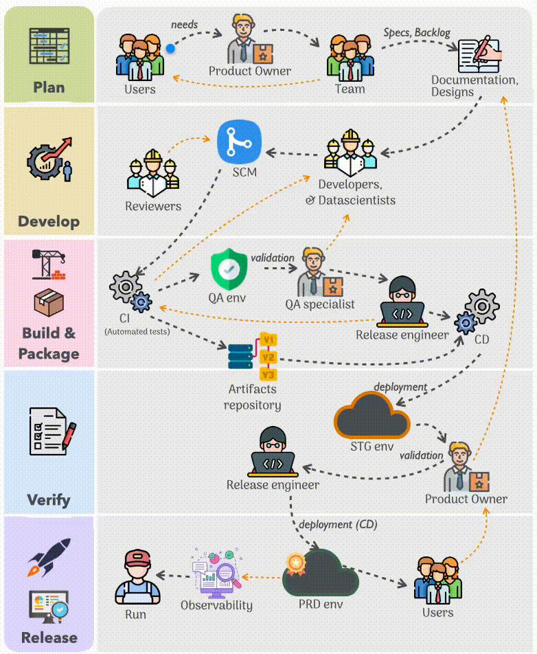

# A User-Centric Delivery Workflow

## From User Needs to Production: A Practical Delivery Workflow

We often focus on technologies, frameworks, and tools. Yet successful delivery remains primarily about people, responsibilities, feedback loops, and quality gates, even as AI empowers every role across the delivery lifecycle.

The workflow described below reflects patterns I have experienced across software, data, and platform projects, with the same objective: turning user needs into reliable outcomes.

*Base workflow for the delivery of a data product*

At its core, this workflow is **user-centric**.

## Starting from user needs

Everything starts with users and their needs.

Those needs are typically collected and prioritized under the responsibility of the Product Owner, often with the support of other contributors such as designers, UX leads, technical leads, or domain experts.

The objective is not only to understand what users ask for, but also why they need it.

Once shared with the delivery team, these needs are progressively refined into a form that is actionable. Depending on the project's practices, this may take the form of:

- specifications,
- RFCs,
- designs,
- backlog items,
- user stories,
- or any other artifact required by the Definition of Ready.

While this step introduces structure, it should not create distance from users. Teams benefit greatly from maintaining the ability to return to users whenever additional clarification is required.

## From understanding to implementation

With a clear understanding of the problem to solve, implementation can begin.

Developers, data scientists, infrastructure engineers, and other contributors work on their respective parts of the solution:

- writing code,
- training models,
- defining infrastructure as code,
- configuring platforms,
- producing documentation,
- and more.

The exact branching strategy is not important here. Teams may adopt GitFlow, trunk-based development, feature branches, or any other model that fits their context.

The important aspect is maintaining a reliable flow from change to validation.

## Review as a feedback loop

As changes are produced, reviewers enter the loop.

Review is not merely a technical formality. It allows peers, technical leads, and security specialists to:

- challenge assumptions,
- improve maintainability,
- identify risks,
- share knowledge across the team.

The feedback generated during review creates short feedback loops that improve the work before it progresses further.

## Automation and continuous integration

Automation provides another layer of confidence.

Continuous Integration (CI) pipelines execute automated checks and tests. These are often associated with unit and integration tests, but modern CI pipelines usually go much further.

They may include:

- static analysis,
- code quality metrics,
- security scanning,
- dependency validation,
- license compliance checks,
- infrastructure validation,
- and other automated verification steps.

The objective is simple:

> Detect issues as early as possible.

Passing code review and automated checks does not necessarily mean a feature is ready for users.

## Quality assurance and user validation

This is where the QA perspective becomes valuable.

Whether performed by dedicated QA specialists, Product Owners, Proxy Product Owners, UX leads, or a combination of these roles, quality assurance provides a broader and more human assessment.

Beyond verifying that a feature works, QA evaluates whether it:

- behaves as expected from a user perspective,
- integrates consistently with the rest of the product,
- avoids functional regressions,
- respects design expectations.

Code quality and product quality are related, but they are not the same thing.

## From validated changes to deployable artifacts

Once the appropriate validations are complete, CI can package and publish deployable artifacts:

- containers,
- binaries,
- libraries,
- datasets,
- machine learning models.

These artifacts are stored in a repository that becomes the trusted source for deployments.

## Release management and deployment

At this stage, release management responsibilities come into play.

Depending on the organization, a dedicated Release Engineer may exist, or the responsibility may be shared among technical leads and platform engineers.

The role is less about performing deployments than about coordinating them according to:

- product strategy,
- operational constraints,
- versioning practices.

Using Continuous Delivery (CD), approved artifacts can be deployed to validation environments such as staging.

These environments provide an opportunity to perform additional verification under conditions that closely resemble production.

When the expected checks have been completed successfully, and under the responsibility of the Product Owner regarding business validation, deployment to production can be approved and executed.

Users can then access the new version and provide feedback, restarting the cycle.

## Operating the system

Once in production, the focus shifts toward operational excellence.

Teams rely on observability to understand the health and behavior of the system.

Metrics, logs, traces, alerts, and dashboards provide visibility into:

- performance,
- reliability,
- system behavior,
- user experience.

In reality, observability should not be limited to production alone. It is equally valuable across:

- development environments,
- CI/CD pipelines,
- testing environments,
- staging platforms.

The diagram intentionally simplifies this aspect to preserve readability.

## Feedback loops are part of the process

The workflow should not be interpreted as a strictly linear sequence.

The optional feedback loops represent essential mechanisms for continuous improvement.

Examples:

- reviewers may request changes from contributors,
- QA may identify improvements before release,
- operational feedback may trigger product discussions,
- users may refine their expectations after seeing an initial implementation.

These loops are not failures of the process. They are how teams learn and improve.

## Roles are responsibilities, not job titles

The roles shown in the workflow should not be confused with job titles or individual people.

A role represents a responsibility, not necessarily a dedicated person.

One individual may fulfill multiple roles, and one role may be shared by several people.

Examples:

- **Users** represent the end users of the product.
- **The Team** represents the whole delivery team, including developers, data scientists, infrastructure engineers, designers, and other contributors.
- **Reviewers** may include peers, technical leads, or security specialists participating in shift-left practices.
- **QA Specialists** may be dedicated QA engineers, Product Owners, Proxy Product Owners, UX leads, or anyone responsible for validating the user and product perspective.
- **The Release Engineer role** may be assumed by technical leads, platform engineers, or dedicated release managers.

## AI as a delivery accelerator

Despite the current excitement around Artificial Intelligence, the fundamental workflow remains largely unchanged.

AI does not eliminate the need for:

- understanding user needs,
- validating quality,
- managing releases,
- operating systems reliably.

What changes is the ability of people to contribute beyond their traditional boundaries.

Developers can accelerate implementation and review activities.

Product Owners can receive assistance with:

- writing specifications,
- refining requirements,
- maintaining documentation,
- preparing validation scenarios.

QA contributors can generate and validate test cases more efficiently.

Documentation can be produced and maintained with less effort.

Operational teams can investigate incidents faster.

AI acts as a force multiplier across the entire delivery chain, empowering individuals to participate more effectively in activities that previously required specialized expertise.

The workflow remains the same, but the people moving through it become increasingly capable, autonomous, and collaborative.

That is perhaps the most significant transformation AI brings to modern delivery organizations.

## Notes

- The workflow should be adapted to each project's context, organization, delivery strategy, and tooling ecosystem.
- The roles shown are responsibilities, not necessarily dedicated individuals.
- Tools and platforms are intentionally omitted from the diagram and can vary widely: GitHub, GitLab, Docker, Kubernetes, AWS, GCP, Azure, Datadog, ELK, and many others.
- Several aspects are intentionally simplified for readability. For example, observability should ideally cover development, CI/CD, staging, and production environments rather than production alone.
